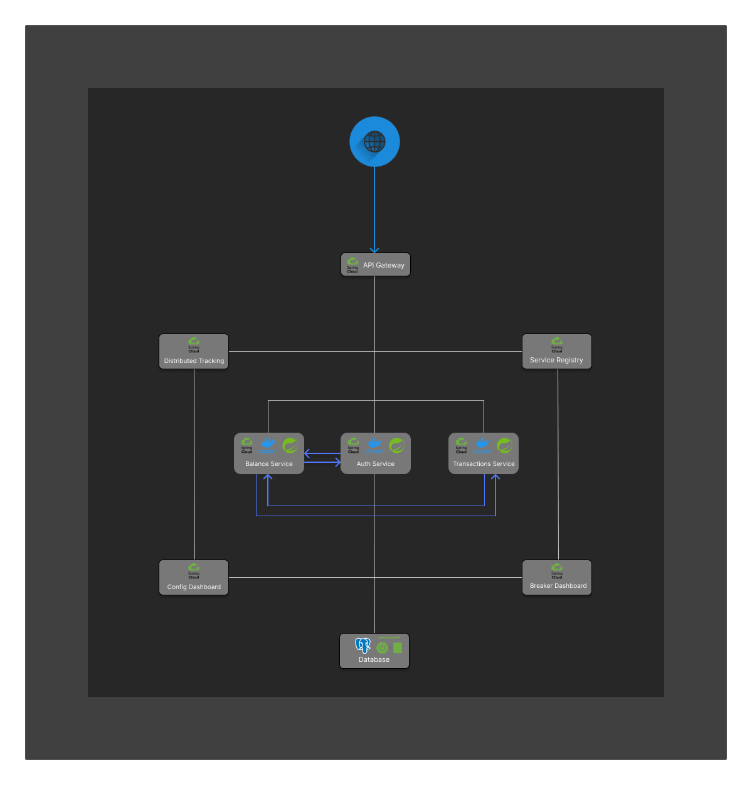

# Personal Finance Tracker

The "Personal Finance Tracker" project is a robust, full-stack application designed for resilience against heavy loads and optimized for security measures. Users can analyze their finance status, income, and expenses through multiple microservices. In the event of a server breakdown, other microservices continue to function, ensuring uninterrupted service. The use of JWT Auth enhances the app's security. Additionally, administrators can control microservices status using Grafana and Prometheus.

## Tech Stacks

- HTML/CSS
- JavaScript
- React
- Docker
- Kubernetes
- Spring Boot
- Spring Security
- Spring Cloud
- JWT Auth
- API Gateway
- Load Balancer
- PostgreSQL
- Zipkin
- Grafana
- Prometheus

## Personal Finance Tracker microservices scheme logic

